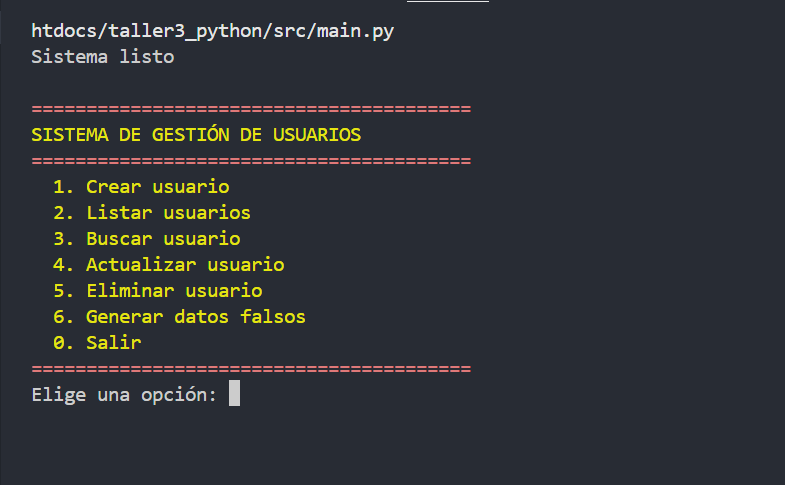
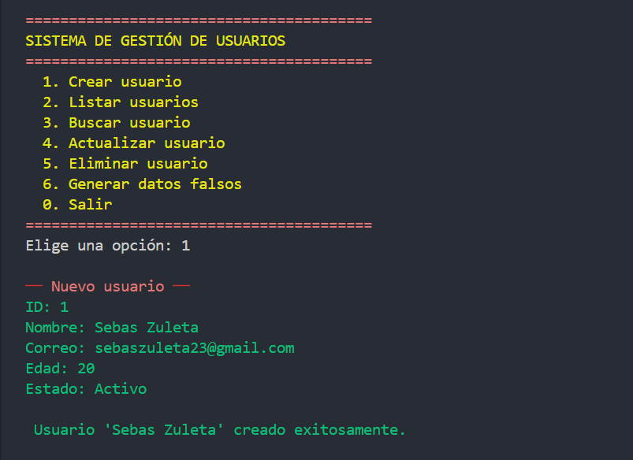
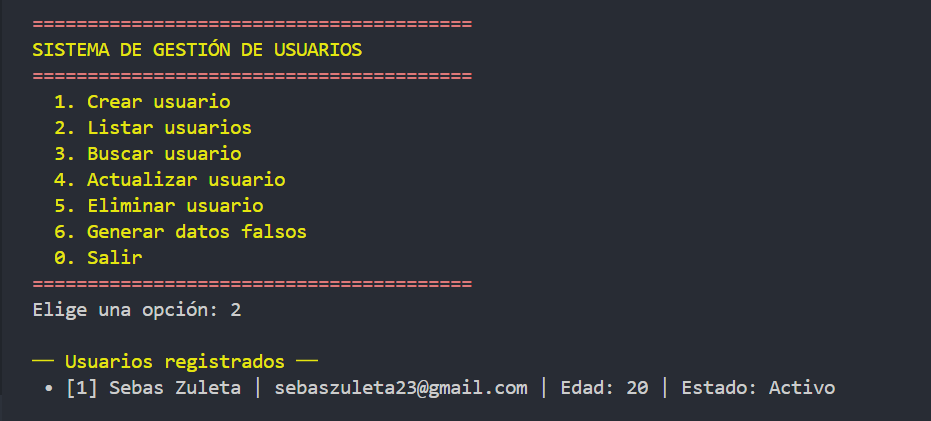
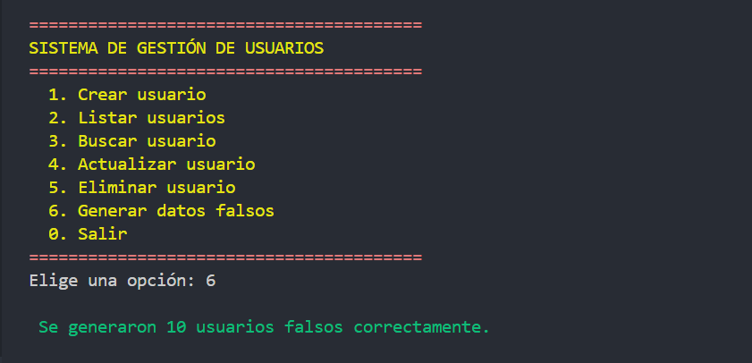
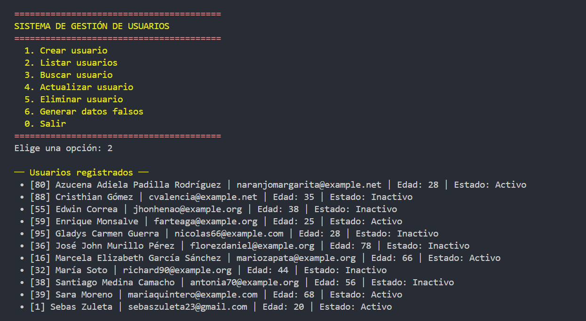

# Sistema de Gestión de Usuarios
 
Sistema en Python con menú interactivo en consola que permite gestionar usuarios localmente mediante operaciones CRUD (Crear, Leer, Actualizar, Eliminar), con persistencia en archivos JSON y código organizado por módulos.
 
## ✨ Características principales
 
- Crear, listar, buscar, actualizar y eliminar usuarios desde la consola
- Persistencia real de datos en archivo JSON
- Validación de todos los campos con mensajes de error claros
- Generación automática de 10 usuarios falsos con Faker
- Interfaz con colores en consola usando Colorama
- Código modular organizado por responsabilidades
- Datos ordenados alfabéticamente al listar
 
## 🗂️ Estructura del proyecto:
 
```
taller3_python/
├─ README.md                         
├─ requirements.txt
├─ .gitignore
├─ assets/
│  ├─ exercise1.py
│  ├─ exercise2.py
│  ├─ exercise3.py
│  ├─ exercise4.py
│  ├─ exercise5.py
│  ├─ exercise6.py
│  └─ images/
│     ├─ menu.png
│     ├─ crear.png
│     ├─ listar.png
│     ├─ faker.png
│     └─ listFaker.png
├─ data/
│  └─ records.json               # archivo de persistencia
├─ src/
│  ├─ main.py                    # punto de entrada
│  ├─ menu.py                    # interfaz de consola (UI)
│  ├─ service.py                 # lógica (CRUD)
│  ├─ file.py                    # persistencia (leer/guardar)
│  ├─ validate.py                # validaciones y helpers
│  └─ integration.py             # generación de datos con Faker
│
└─ tests/
│  ├─ __init__.py
│  ├─ test_validate.py
```
 
## ▶️ Instalación:
 
1. Clona el repositorio:
   ```bash
   git clone https://github.com/Ez-Sebas/Taller-3-Proyecto-de-Transferencia.git
   cd taller3_python
   ```
2. Instala las dependencias:
   ```bash
   pip install -r requirements.txt
   ```
3. Ejecuta el programa:
   ```bash
   python src/main.py
   ```

## 🧪 Pruebas

Para ejecutar las pruebas del proyecto:

```bash
pytest tests/
```

Se correrán 4 pruebas automáticas sobre las validaciones del sistema.
## 💻 Uso:
 
Al ejecutar el programa, se mostrará un menú interactivo en consola:
 
```
1. Crear usuario
2. Listar usuarios
3. Buscar usuario
4. Actualizar usuario
5. Eliminar usuario
6. Generar datos falsos
0. Salir
```
 
Flujo básico:
1. Crear un usuario ingresando ID, Nombre, Correo, Edad y Estado
2. Consultar todos los usuarios registrados ordenados alfabéticamente
3. Buscar un usuario específico por su ID
4. Actualizar los datos de un usuario existente
5. Eliminar un usuario por ID o eliminar todos
6. Generar 10 usuarios falsos automáticamente con Faker
 
El sistema mostrará mensajes claros indicando si la operación fue exitosa o si ocurrió algún error.
 
## 📸 Screenshots
 





 
## 👤 Datos del Autor
 
| Campo | Información |
|---|---|
| **Nombre** | Sebastián Zuleta Echavarría |
| **Ficha** | 3406211 |
| **Programa** | Análisis y Desarrollo de Software |
| **Ciudad** | Copacabana, Antioquia |
| **Correo** | zuletas092@gmail.com |
| **GitHub** | [Ez-Sebas](https://github.com/Ez-Sebas) |
 
## 📄 Licencia:
Este proyecto fue desarrollado con fines educativos para el SENA. Uso libre para aprendizaje.